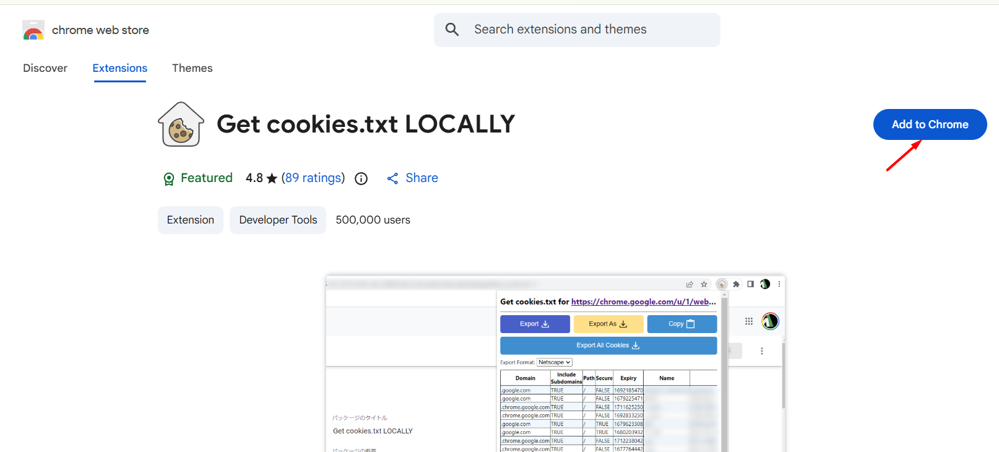
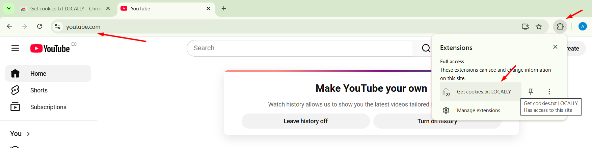
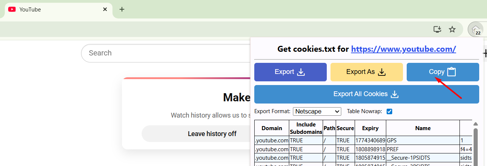

# YouTube Cookies

Some YouTube videos are age-restricted, region-locked, or otherwise require authentication before they can be downloaded. When Mazinger's download stage fails with a **403**, **Sign in to confirm your age**, or similar error, you need to pass your YouTube cookies so that `yt-dlp` can authenticate on your behalf.

## Why cookies are needed

YouTube increasingly requires a logged-in session to serve certain content. Cookies prove to `yt-dlp` that you have an active, authenticated session — no password is ever shared.

## How to export your cookies

The easiest method is a browser extension that exports cookies in the **Netscape / cookies.txt** format.

### Step 1 — Install the extension

Install [**Get cookies.txt locally**](https://chromewebstore.google.com/detail/get-cookiestxt-locally/cclelndahbckbenkjhflpdbgdldlbecc) from the Chrome Web Store (works in Chrome, Edge, Brave, and other Chromium browsers).



### Step 2 — Open it on YouTube

Go to [youtube.com](https://www.youtube.com) and **make sure you are logged in**. Then click the extension icon in the toolbar.



### Step 3 — Copy or save the cookies

Click **Copy** to copy the cookies to your clipboard, or **Export** to download a `cookies.txt` file.



## Passing cookies to Mazinger

### CLI — `--cookies` flag

Save the cookies to a file (e.g. `cookies.txt`) and pass the path:

```bash
mazinger dub "https://youtube.com/watch?v=VIDEO_ID" \
    --cookies cookies.txt \
    --clone-profile abubakr \
    --target-language Arabic
```

The `--cookies` flag is available on `dub`, `download`, and `slice` commands.

### CLI — `--cookies-from-browser` flag

Alternatively, let `yt-dlp` read cookies directly from your browser (no file needed):

```bash
mazinger dub "https://youtube.com/watch?v=VIDEO_ID" \
    --cookies-from-browser chrome \
    --clone-profile abubakr \
    --target-language Arabic
```

Supported browsers: `chrome`, `firefox`, `edge`, `brave`, `opera`, `safari`, `chromium`.

> **Note:** This requires the browser to be closed (or at least not actively using the cookie database). On some systems it may require additional permissions.

### Python API

```python
from mazinger import MazingerDubber

dubber = MazingerDubber(openai_api_key="sk-...")

proj = dubber.dub(
    source="https://youtube.com/watch?v=VIDEO_ID",
    voice_sample="speaker.m4a",
    voice_script="transcript.txt",
    target_language="Spanish",
    cookies="cookies.txt",                  # path to Netscape cookies file
    # cookies_from_browser="chrome",        # OR read from browser directly
)
```

### Mazinger Studio (Colab)

In the Gradio notebook, expand the **🍪 YouTube Cookies** section below the source input, paste the cookie text directly, and it will be used automatically.

## Security tips

- **Never share your cookies file.** It grants full access to your YouTube account.
- Add `cookies.txt` to your `.gitignore` so it is not accidentally committed.
- Cookies expire — if downloads start failing again, re-export a fresh copy.
